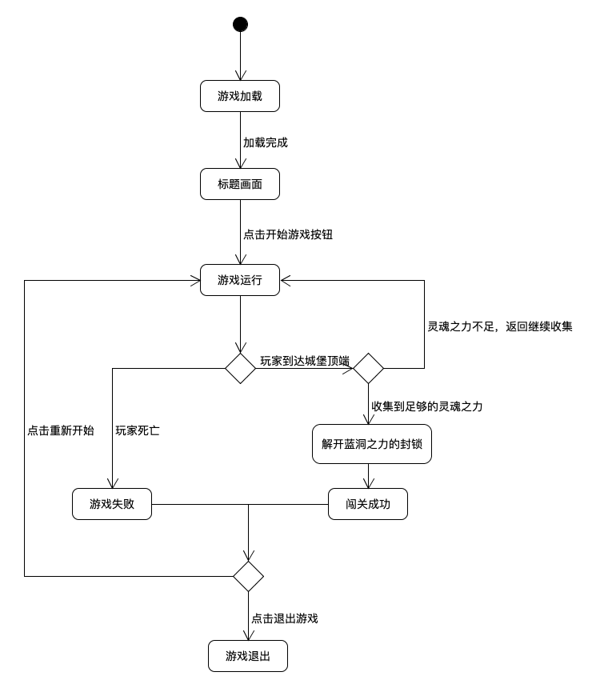

毕设第三章：内容设计

3.1 游戏综述

JumpCastle是一款以3D模型模拟2D画面的平台跳跃游戏。玩家需要扮演【具有暗黑力量的少年凡·达克霍姆 （名字待定）】，在危机重重的城堡中躲避危险的敌人，收集增强能力的道具，直至登上堡垒之巅。


3.1.1 游戏背景

（编一个600字的故事……就胡扯吧，把自己想到的所有喜欢的人物搞在一起，要不就编成比利海灵顿）

六十亿年前，坐落在现今河北省境内的新日暮里原来是一个充满欢乐与和平的部落，里面原来住着各种各样的村民。有儒雅随和的孙村长，有生命力顽强的木吉酱，勇气可嘉的保卫队长醒哥，心地善良却总是把事情搞砸的排骨等。长久以来，新日暮里的居民们一直都过着愉快安静的生活，这是因为他们一直都受到了大力神Billy王的庇护。然而，一个突如其来的意外打破了新日暮里的平静生活。一个拥有着邪恶力量的恶魔，非凡哥，闯进了新日暮里，带领恶犬部队横冲直撞，抢走了新日暮里的一切，还用邪恶力量控制了暮里村保卫队长醒哥，让醒哥成为了他的下属。幸运的是，在浩劫到来的时候，正在自家地牢里修炼的少年凡·达克霍姆，在地牢复杂的路径和黑色面具的双重隐蔽下，躲过了非凡哥的搜查。几个月后，他从地牢回到地上时，发现眼前的景象与先前大不相同，这时候东方仙人出现，告诉了他一切，并且告诉他，他体内的暗黑之力可以与性格体内的精神病毒解除醒哥的思想控制，联合达克霍姆和醒哥的二人之力，就可以与非凡哥的邪恶军队抗衡。达克霍姆下定决心拯救新日暮里，他从东方仙人口中得知，非凡哥占领了达克霍姆地牢正上方的蓝洞城堡，将控制新日暮里的力量核心安放在城堡的顶端。遭受灾难的几个月之内，无数的勇士攻入城堡，却没有一人生还。整个城堡布满了各种陷阱，通路处有有恶犬部队把守。城堡顶端的力量核心处围绕着扭曲物质“蓝洞”，在城堡冒险的途中，已故勇士的亡魂会强化达克霍姆的能力。只有自己的能力强大到能与自然相抗衡，才可以最终打破蓝洞周围的物理定律，取回力量核心，拯救新日暮里。

（出场人物记录： 凡·达克霍姆、醒哥、非凡哥、Billy王、东方仙人；孙村长、排骨； 另外：达克霍姆地牢、蓝洞城堡、恶犬部队）（彩蛋：香蕉君的终末助力）


3.1.2 游戏流程

游戏流程图如【下图（记得重新编号）】所示。

- 打开游戏，先进入加载界面，显示loading动画以及提示加载中；
- 游戏的基本资源加载完毕后，切换到标题画面，包含“开始游戏”按钮和声音开关按钮，同时开始播放用于标题画面的背景音乐；
- 玩家点击“开始游戏”按钮后，进入游戏运行场景，加载主角、城堡地图、陷阱、怪物、道具物品；
- 玩家受到足够多的伤害会死亡，此时游戏结束，提示游戏失败，此时可以选择重新开始；
- 当玩家爬到城堡顶端，并收集到足够的灵魂之力，取得力量核心时，游戏结束，提示闯关成功，之后可以通过点击按钮回到标题画面。



3.2 游戏元素

本节主要围绕游戏中的几个关键元素进行介绍，包括游戏的玩家、怪物、道具以及地图元素。


3.2.1 玩家

JumpCastle游戏中，玩家扮演的是具有暗黑力量的少年凡·达克霍姆。新日暮里部落被恶魔非凡哥占领之后，无数勇士闯进非凡哥的城堡想要取回控制新日暮里的力量核心，却无一人生还。玩家扮演的角色正是真正拥有破除这一切罪恶能力的勇士。玩家需要控制勇士达克霍姆，在城堡中不断向上行进，躲避敌人和危险地带，收集各种各样的物品强化自身，最终破除蓝洞之力的封印，取回力量核心，解救新日暮里。

玩家具有的属性，如【图X-X， 一个类图，包含玩家的所有属性】所示，具体属性说明如下：

- 名称
  该属性表示玩家名称。默认为Van Darkholme，该属性在游戏开始后不可修改。
- 生命值
  该属性表示玩家的生命值，用于判断玩家生存状态。该属性在游戏过程中可以变化。生命值最大值为100，最低值为0。该属性在游戏开始时的初始值100。当玩家接触地图陷阱，或遭受敌人攻击时，玩家的生命值会根据伤害来源的种类，减少对应的数值。当玩家收集到治愈类道具时，玩家生命值会增加。当生命值为0时，玩家死亡。
- 金钱
  该属性表示玩家拥有的金币总数。该属性在游戏过程中可以变化。金币是JumpCastle游戏中用于购买道具的虚拟货币。游戏开始时，金钱的初始值为0。当玩家击杀怪物时，金钱会增加。玩家购买道具时，金钱会减少。
- 灵魂之力
  该属性表示玩家拥有的灵魂之力。该属性在游戏过程中可以变化。灵魂之力出现在JumpCastle游戏地图的各个角落，玩家需要收集足够的灵魂之力，才可以解开城堡顶端蓝洞之力的封印，取得力量核心，从而通关。游戏开始时，灵魂之力初始化为0，当玩家接触到地图上灵魂之力的光点时，灵魂之力会增加。
- 攻击力
  该属性表示玩家的攻击能力。该属性在游戏过程中可以变化。JumpCastle游戏中，玩家可以使用中距离的攻击发射能量弹攻击敌人。当玩家攻击敌人时，攻击力决定了能量弹击中时，怪物生命的减少量。攻击力初始值为10。在游戏进程中，当玩家获得攻击力增强的道具时，玩家的攻击力会增加。
- 移动速度
  该属性表示玩家的移动速度。该属性在游戏过程中可以变化。JumpCastle游戏中，玩家的移动速度决定了玩家在城堡地面上移动的速度。速度的初始值为10。在游戏过程中，当玩家走到影响移动速度的地图块上，或是收集到特定的道具时，移动速度会改变。
- 护盾充能值
  该属性表示玩家的特殊技能“无敌护盾”的可用状态。该属性在游戏过程中可以变化。JumpCastle游戏中，玩家可以使用特殊技能“无敌护盾”。该技能开启时，玩家将进入2秒的无敌状态，无敌状态下不会受到任何伤害，但仍可以移动、攻击和收集物品。护盾充能值最小为0，最大值为100。游戏开始时，护盾充能值初始化为50。当玩家使用“无敌护盾”时，护盾充能值减少50。在游戏进程中，每当玩家收集到1点灵魂之力，护盾充能值+1；玩家每击杀一个敌人，护盾充能值+5。当玩家收集到特殊物品“能量结晶”时，护盾充能值增加，增加值为收集到的能量结晶中的数值。当玩家购买了商店道具“醒哥的激励”后，护盾充能值可以随着时间流逝缓慢恢复，每秒恢复1点。当护盾充能值 < 50时，“无敌护盾”技能不可用。
- 每秒护盾回复
  该属性表示玩家的护盾充能值随时间回复的速度。该属性在游戏过程中可以变化。游戏开始时，该属性初始为0，即护盾充能值不随时间回复。当玩家购买了商店道具“醒哥”的鼓励之后，每秒护盾回复会+1，即护盾充能值每秒回复1点。另外，当玩家获得了特殊道具，或处于特殊位置时，每秒护盾回复也会因具体情况改变。
- 拥有的物品
  该属性表示玩家所拥有的物品。该属性在游戏过程中可以变化。游戏的地图和商店中存在几种不同种类的道具，当玩家在地图中收集或购买到这些道具时，该属性中将增加对应的物品条目。当玩家失去某物品时，该属性中相对应的物品条目会被删除。
- 增益、减益状态
  该属性表示玩家当前拥有的一切增益、减益状态。该属性可以改变，游戏开始时为空。当玩家在游戏进程中获得特定道具、或触发特定事件时，获得的特殊状态会记录在该属性中。

【图X-X， 玩家的类图】


3.2.2 怪物

JumpCastle游戏中，非凡哥在蓝洞城堡里布下了可怕的怪物把守。怪物有自己的巡逻范围，当他们发现玩家时，会攻击玩家，对玩家造成伤害。玩家可以通过击败怪物来获得金币、物品和护盾充能。

怪物具有的属性如【图X-X所示， 怪物的类图，包含下面说到的怪物的所有属性】。具体说明如下：

- ID
  该属性表示怪物的编号，由系统自动生成并设置。该属性不可修改。
- 种类
  该属性表示怪物的种类，在怪物生成时确定。该属性不可修改。
- 生命值
  该属性表示怪物的生命值，用于判断怪物的生存状态。默认值与怪物种类有关。该属性可以修改。当怪物遭受到玩家攻击后，怪物生命值会减少。当怪物的生命值减少至0时，怪物死亡，从地图上消失，同时玩家获得奖励。
- 携带金钱
  该属性表示怪物身上携带的金币总数。在怪物生成时，该数值由系统在一定数值范围内随机生成，生成之后该属性不可修改。当怪物被玩家击败后，该怪物的金钱值不需改变，玩家的金钱值会相应增加，增加值为被击败怪物的携带金钱数量。
- 攻击力
  该属性表示怪物的攻击能力，默认值与怪物种类有关。该属性可以修改。一种怪物的攻击力，会在怪物本身低生命值时提高。当怪物攻击玩家时，攻击力决定了玩家生命值的减少量。
- 速度
  该属性表示怪物的移动速度。默认值与怪物的种类有关。该属性可以修改。一种怪物的速度，会在其本身低生命值时加快。
- 可掉落道具
  该属性表示怪物被击杀时可以掉落的道具及掉落概率。默认值与怪物的种类有关，在怪物生成时由系统自动生成并设置。该属性在生成后不可修改。当怪物被玩家击败后，根据怪物的可掉落道具，在怪物被击败的地点，会根据概率随机出现怪物可掉落的物品，这些物品可以被玩家收集。

【怪物一共有几种，每一种怪物的特性】

【图X-X 怪物的类图】


3.2.3 道具

在JumpCastle游戏中，玩家可以通过击败怪物、在地图中收集以及在商店交易来获得道具。不同的道具有不同的作用。

道具具有的属性如【图X-X 道具的类图】所示，具体的属性说明如下：

- ID
  该属性表示道具的编号，由系统自动生成并设置。该属性不可修改。
- 种类
  该属性表示道具的种类，在道具生成时确定。该属性不可修改。
- 数量
  该属性表示道具的数量。该属性在道具生成时确定，生成后不可修改。这里道具的“数量”，在不同道具中代表的具体意义不同。例如，在“能量结晶”中，道具的数量代表能量结晶可以为玩家恢复的护盾充能数；在“食物”中，道具的数量代表该食物能够为主角回复的生命值。

【道具一共有几种，每一种道具的作用】

【图X-X 道具的类图】


3.2.4 地图元素

JumpCastle游戏中，在非凡哥的蓝洞城堡里，拥有各种不同的地图元素。一些是安全的普通地面，同时也存在能够给玩家带来特殊效果的地图元素。

地图元素具有的属性如【图X-X 地图元素的类图】所示，具体说明如下：

- ID
  该属性表示地图块的编号，由系统自动生成并设置。该属性不可修改。
- 种类
  该属性表示地图元素的种类。在地图元素生成时确定。该属性不可修改。地图的种类包含“普通地图”“传送点”“特殊”三种。
- 是否为“陷阱”类元素
  当地图元素种类为“特殊”时可用。该属性表示地图块是否为“陷阱”。在地图元素生成时确定。该属性不可修改。当玩家站在“陷阱”地图块上时，每秒会受到伤害。
- 是否为“能力修正”类元素
  当地图元素种类为“特殊”时可用。该属性表示地图快是否为“能力修正”类。在地图元素生成时确定。该属性不可修改。当玩家站在“能力修正”地图块上时，一些属性会变化。
- 陷阱元素的伤害值
  当地图元素种类为“特殊”时可用。该属性表示当地图块为“陷阱”时，其每秒能够对玩家造成的伤害。在地图元素生成时确定。该属性不可修改。
- 能力修正元素的修正类别与对应值
  当地图元素种类为“特殊”时可用。该属性表示当地图块为“能力修正”时，其所影响的玩家属性类别和对应的修正值。在地图元素生成时确定。该属性不可修改。同一“能力修正”地图块可以同时影响多个不同的玩家属性。该属性为使用字典存放，字典的key为玩家属性名称，value为对应的属性修正值。

【地图元素一共有几种，每一种地图元素的作用】

【图X-X 地图元素的类图】


3.3 游戏详细规则

本节内容介绍了游戏的详细规则。包括玩家的移动规则、生命规则、攻击规则、交易规则，怪物的生命规则、巡逻与移动规则、攻击规则，以及道具和地图元素的详细规则等。


3.3.1 玩家的移动规则

玩家的移动规则如【图X-X】所示。玩家在水平方向的移动由WASD控制，按K键跳跃。由于是2D横版游戏，普通移动只包含左右方向。W键和S键在按住的时候，配合跳跃键K可以使出不同高度和速度的跳跃。当移动方向上存在障碍时，玩家不能移动。当玩家处于空中时，可以再跳跃一次，即“二段跳”。

【图X-X 玩家移动（的状态图）】

3.3.2 玩家的生命规则

玩家的生命规则如【图X-X】所示。玩家初始生命值为100，当玩家获得生命恢复类道具时，玩家的生命值增加，但不会超过最大值100。当玩家受到怪物攻击或接触地图中的陷阱时，玩家受到伤害，生命值减少。当玩家的生命值减少到0时，玩家死亡。

【图X-X 玩家生命（状态图）】

3.3.3 玩家的攻击与技能规则

玩家的攻击与技能规则如【图X-X】所示。玩家可以通过按下J键攻击，向前方发射能够飞行一定距离的能量弹。玩家在站立、跑动以及跳跃的时候均可攻击。当能量弹击中怪物时，怪物根据该子弹的攻击力，受到相应数值的伤害。另外，玩家可以通过按下【空格键】来使用特殊技能“无敌护盾”。当玩家的护盾充能值大于等于50时，该技能可以使用，使用时，玩家的护盾充能值减少50。当玩家的护盾充能值小于50时，该技能不可使用。

【图X-X 玩家攻击与技能】

3.3.4 玩家的金钱规则

玩家的金钱规则如【图X-X】所示，玩家的金币初始数量为0，金币数量没有最大值。玩家击败怪物时，玩家拥有的金币数量会增加。当玩家购买道具时，玩家的金币会减少。当玩家持有的金币数量小于道具的价格时，玩家无法购买道具。

【图 玩家金钱规则】

3.3.5 怪物的生命规则

怪物的生命规则如【图】所示。怪物的初始生命值与怪物的种类有关。当怪物受到玩家的攻击时，怪物受到这一次的攻击力数值的伤害，生命值减少相应的数值。当怪物的生命值减少为0时，怪物死亡，从地图上消失。

【图 怪物生命规则】

3.3.6 怪物巡逻与移动规则

怪物的巡逻与移动规则如【图】所示。怪物在水平方向上移动时，如果移动方向上存在障碍，怪物在接触到障碍之后，将倒转方向。当玩家进入到怪物的侦测范围内时，怪物朝玩家移动。当玩家离开怪物的侦测距离后，怪物恢复原来的巡逻模式。当怪物接触到玩家时，怪物对玩家造成伤害，伤害值取决于怪物种类。

【图 怪物巡逻与移动】

3.3.8 道具的掉落规则

道具的掉落规则如【图】所示。当怪物被击倒时，系统将根据该种类怪物的“可掉落道具”属性，在怪物被击倒的地点随机生成道具。如果道具拥有“数量”属性，系统在生成该道具时，会随机确定该道具的“数量”。

【图 道具掉落】

3.3.9 道具与其他地图元素的接触规则

道具与其他地图元素的收集规则如【图】所示。当玩家接触到道具或地图元素时，系统通过碰撞检测，判定玩家接触到的物品类别。如果是道具，则执行获取对应道具的逻辑，增加相应物品数量，或着恢复一些数值；如果是特殊地图元素，则继续根据地图元素的种类，判定其具体参数，进而执行相应的伤害或属性修正效果；如果是商店中待出售物品，则不操作，直到玩家按下“购买”键之后，进入与获得普通道具相同的逻辑。

【图 道具与其他地图元素】

3.3.10 地图传送规则

地图传送规则如【图】所示。当玩家走到一个新的传送点时，此传送点被标记为“已到达过”。若此时存在其他“已到达过”的传送点，则玩家可以通过按R键，来快速传送到前一个传送点，也可以使用T键传送到后一个传送点。

【图 地图传送规则】


3.4 游戏操作

JumpCastle游戏使用键盘控制。

- A、D键：向左、向右移动；

- J键：攻击，向玩家前放发射子弹。

- K键：跳跃。玩家可以使用“二段跳”，即在空中时也可以再跳跃一次。

  - W+K键：在起跳同时按住W键，可以增加跳跃高度。
  - S+K键：在起跳同时按住S键，可以增加跳跃过程中玩家的飞行速度。

- 空格键：特殊技能“无敌护盾”。使用后玩家进入2秒的无敌状态。可以移动、攻击、收集物品，但不会受到任何形式的伤害。

- F键：当玩家在商店中时，走到出售的道具旁边，按F键购买道具。

- R键、T键：当玩家站在传送点上时，若此时已有其他已经到达过的传送点，则可以使用R键快速传送到前一个到达过的传送点，可以使用T键快速传送到后一个到达过的传送点。

  

3.5 游戏界面

3.5.1 载入画面

3.5.2 标题画面

3.5.3 游戏运行

3.5.4 玩家死亡

3.5.5 闯关成功

（3.5.6 道具购买界面）

（3.5.7 地图快捷传送界面）


第四章： 架构与模块设计

本节从游戏开发中用到的几个关键类及其结合方式入手，介绍了游戏的架构。

4.1 场记管理类 SceneController

场记管理类是一个单例类。该类负责记录整个游戏进程中都存在的数据，处理贯穿整个游戏的事务，包括游戏载入、游戏开始、结束、重新开始等。

- 游戏最开始运行时，最先实例化该类。该类在创建的时候会调用用于引擎初始化的子模块，对所使用的BabylonJS引擎进行一系列的设置，包括确定画面尺寸、重新设置按键事件等。
- 然后在该类的控制下，提前载入必要的资源，包括玩家模型、怪物模型、地图材质等。所有游戏进程中使用到的关键类都在SceneController中注册，使得场记管理类可以总体控制游戏中所有元素的行为。
- 游戏第一次开始时，通过SceneController类的控制，初始化所有用到的类，同时注册必要的消息通信函数。
- 游戏开始时，SceneController类重置自身状态，同时下发指令，控制其他元素的初始化，包括重置玩家状态、重新生成怪物、重新生成地图道具、重置游戏内的事件及传送点进度。
- 游戏结束时，通过SceneController类来控制整个游戏的重新开始逻辑。
- 游戏退出时，使用场记管理类对所有被控制的子类下发析构信息，逐步释放资源。

【图4-X】展示了SceneController与其他关键类的关系。【画一个SceneController， 连接的其他类只需要简单表述，不用详细写出其他类里所有的属性方法】


4.2 GUI类 GUIController

GUI类用于生成和控制游戏中的按钮、HUD等。GUI类底层使用了BabylonJS引擎官方提供的babylonjs-gui包，与BabylonJS游戏引擎有之间有优秀的兼容性。

GUIController类受到场记管理类SceneController的控制，在游戏最开始运行时被实例化。该类负责在游戏运行的不同阶段展示对应的UI界面，包括：载入界面的进度显示、标题画面的声音控制与游戏开始按钮、游戏进程中的HUD以及效果文字显示、游戏结束画面的重新开始和返回标题画面按钮。

当任何按钮被点击时，GUIController获取点击事件，将对应的事件处理逻辑传回到SceneController，之后由SceneController将对应的任务分发给特定类。

【类图 就一个简单的 单独的类图】


4.3 玩家类 Player

Player类在每次游戏重新开始时会在SceneController的控制下初始化。Player类包含玩家的角色模型及材质、在第三章中介绍过的所有属性，以及一系列事件处理函数。

【类图 就一个简单的 单独的类图】


4.4 怪物的生成与管理

怪物的生成与管理通过Monster和MonsterFactory两个类来完成。每个怪物个体均为Monster类的一个实例，这些实例通过MonsterFactory来统一进行管理。MonsterFactory类在上层SceneController中注册，从而实现了由SceneController对怪物的间接管理。

- Monster类包含一个怪物的所有属性、对应的事件处理函数，以及怪物的模型和材质。
- MonsterFactory是一个工厂类。每次游戏重新开始时，该类都会在SceneController的控制下被初始化。
- MonsterFactory类包括存放所有Item实例的列表、几种道具的预置参数、一系列与道具的创建和销毁等事件有关的事件处理函数。当需要创建一个新的怪物时，外部只需调用工厂类中的怪物生成函数，指定其类型和生成位置，其余的参数则通过该工厂类内部保存的预置参数确定。
- 当一个怪物被击倒时，本次击倒事件交由事件处理模块处理，之后怪物对应的Monster类实例被销毁，同时MonsterFactory类中将该实例移除。

【类图 Monster与MonsterFactory的关系】


4.5 道具元素的生成与管理

道具元素的生成与管理模式与怪物的管理模式类似，也是通过Item与ItemFactory两个类来完成。每个道具均为Item类的一个实例，这些实例通过ItemFactory统一管理，所有道具的生成、检索、销毁均通过ItemFactory类进行。

- Item类包括对应道具的模型及材质、道具拥有的一切属性、该道具的所有事件处理函数。
- ItemFactory是一个工厂类。每次游戏重新开始时，该类都会在SceneController的控制下被初始化。
- 同样，ItemFactory类包括存放所有Item实例的列表、几种道具的预置参数、一系列与道具的创建和销毁等事件有关的事件处理函数。
- 当一个道具被玩家获得时，道具的详细信息传送到事件处理模块处理，之后该道具实例被销毁，同时在ItemFactory类中移除此对道具实例的引用。

【类图 item与itemFactory的关系】

4.6 地图元素的管理

JumpCastle游戏使用3D模型模拟2D画面，游戏中城堡的地图也是使用3D对象生成。地图元素的管理由Map和MapBlock两个类管理。MapBlock类的每个实例代表单个地图块，Map类则将所有MapBlock实例统一管理。

- MapBlock类中包含地图元素的模型及材质、地图元素拥有的一切属性、以及所有相关的事件处理函数。
- Map类中包含存放所有MapBlock实例的列表、整张地图中所有地图快的预期位置、几种地图元素的预置参数、一系列与创建、销毁有关的函数。
- 游戏启动时，Map类在SceneController初始化时被实例并初始化，并被注册在SceneController中。在载入界面中，在SceneController调用Map类中的generateMap()方法时，Map类根据保存的地图块位置集来生成整张地图。

【类图 Map&MapBlock的关系】


4.7 订阅-发布模式处理事务

在JumpCastle游戏中，有大量的“事件”需要处理，如：玩家攻击到怪物、玩家受到怪物攻击、玩家拾取道具、玩家接触到特殊地图元素从而受到影响等。一个事件往往可以引起多个对象状态的改变，则事件对应的处理逻辑必然包含对不同对象的操作。在这种情况下，将某个事件的处理函数写在单独的某个对象之内，会使代码结构混乱，耦合度变高，难以维护。如果把所有的事件处理函数全部集中到一个整体的”事件处理器“中，同样会导致管理混乱，不能直观区分每个函数具体影响的对象。

针对这种情况，本文使用”订阅-发布模式“解决事件处理的问题。订阅-发布模式的核心，在于事件产生和事件处理代码之间的分离。在订阅-发布模式中，对象可以是信息的发布者或订阅者。当一个对象能够直接”感知“某个事件的发生时，这个对象是该事件的发布者；当一个对象的状态会因为某一种事件的发生而改变时，该对象是这个事件的订阅者。以“玩家接触到具有伤害玩家效果的火元素地图块”这一事件为例，由于是地图块“感知”到了玩家走到了其位置之上，所以该事件的发布者是“火元素地图块”；玩家会因为接触火元素地图块而受到伤害，所以玩家是该事件的订阅者。另外，一个对象可以同时是一个事件的发布者和订阅者。以“玩家触碰地图上的可收集道具”为例，该事件的发布者为“玩家所触碰到的道具”，订阅者则同时包含玩家、道具的工厂类和被触碰的道具本身。这是因为道具被玩家收集之后，需要从地图上消失，这个过程需要通知ItemFactory类移除对该道具实例的引用，同时销毁对象的过程需要该道具本身来完成。

订阅-发布模式需要一个专用的事件处理模块，作为所有信息交换的区域。对于“一个对象同时是事件的发布者和订阅者”这一情形，可以用伪代码表述如下：

(a) 在事件处理模块中预先注册事件类型：

```
EventDispatcher.registerMsgType("EventTypeA");
```

(b) 所有需要对该事件作出反应的对象，在事件处理模块中订阅该类型的消息，同时在自身内部定义处理该类型消息的方法：

```
void subscribeMessages() {
    EventDispatcher.subscribeMsgType(MsgType="EventTypeA", self.callbackOnEventTypeA);
}
void callbackOnEventTypeA(msg) {
    // do something
}

```

(c) 对象感知到事件，发布信息：

```
void OnSomethingHappened() {
    sendMsgToEventDispatcher(self.msgToSend(), MsgType="EventTypeA");
}
```

(d) 事件处理模块接收到信息，将信息分发给所有订阅者：

```
void EventListener::recvMsg(msg, MsgType) {
    for subCallbacks in self.subscribers.findSub("EventTypeA") {
        subCallbacks(msg);
    }
}
```

【画一个类之间的关系图，包含 事件发布者、订阅者（多个订阅者，同时发布者本身也可以是订阅者）、事务处理模块EventDispatcher】


第五章： 部署与运行

5.1 游戏部署

JumpCastle游戏的部署如【图 5-1】所示。

【图5-1 一个部署图， 参考sample 6.1里面的】

游戏使用Nodejs部署，Webpack打包，二者的关键配置如下：

【然后一些部署用的脚本代码贴上： package.json 和 webpack.config.js， 然后对这些config进行一些简单的解释说明】

游戏可以在任何支持HTML5+CSS3+WebGL的浏览器中运行，如Google Chrome, Mozilla Firefox。

5.2 游戏运行测试

应用环境：

- 操作系统： Windows 10 1809

- 浏览器： Google Chrome Version 73.0.3683.86 (Official Build) (64-bit)

运行结果

游戏运行截图如【图5-2】所示。在测试环境中，游戏功能基本正常，音频播放正常，玩家的移动、跳跃、攻击、收集道具、受到伤害等功能正常。

【图5-2 游戏运行图】


第六章： 总结与展望 【叙述套路借鉴一下sample】

6.1 研究成果

HTML5和WebGL技术的出现，使得网页展示多媒体内容的能力更进一步，开发人员不需要额外借助如FlashPlayer等插件，就可以在HTML5 canvas元素中方便地绘制3D内容，进而展示复杂的3D场景。本文通过设计一款基于WebGL和BabylonJS的HTML5游戏“JumpCastle”，对浏览器端应用的3D技术进行了测试和研究。另外，HTML5的audio元素使网页播放音频页更加便捷，JumpCastle游戏中的声音播放就是使用了audio元素。本文中，JumpCastle是一款使用3D建模模拟2D画面的游戏，通过这种技术展示的2D画面，显示效果比普通的纯2D画面更加生动连贯。游戏的3D建模通过Blender完成，然后使用BabylonJS进行场景的绘制和游戏逻辑的完成。本文从游戏背景故事、游戏关键元素、游戏规则与操作等方面介绍了游戏的基本内容，同时介绍了游戏的架构、重要模块的设计实现，以及游戏的部署和运行。

JumpCastle是一款跨平台的HTML5游戏，可以在任意平台下支持WebGL的网页浏览器中运行，无需针对不同平台开发不同的版本。与使用FlashPlayer的游戏相比，JumpCastle游戏直接通过HTML5的多媒体元素呈现与运行，兼容性更好，安全性更高。JumpCastle游戏使用了订阅-发布模式来处理游戏中数量繁多、行为复杂的事件，做到了模块之间的高度解耦，使代码可读性强，易于维护，开发效率更高。游戏的数据采用浏览器应用中广泛使用的JSON格式，JSON数据具有体积小、传输速度快、浏览器可以直接解析的优点。

6.2 将来的工作

在设计实现JumpCastle游戏的过程中，可以发现，WebGL技术具有极大的发展潜力。目前，本文设计的游戏只设计了针对电脑端的操作，而没有针对移动端做对应的匹配。这使得虽然一些支持WebGL的移动端浏览器能够打开本游戏，但还没有合适的视图以及方便移动端的操作方式。同时，在游戏的测试过程中，能够发现，BabylonJS+WebGL的技术，在场景中存在大量3D元素和复杂的粒子效果时，游戏帧数会明显下降。所以在之后，一方面会尝试将JumpCastle游戏做出适合移动端操作的版本，另一方面，会对WebGL和BabylonJS的底层进行研究，探索提升游戏性能的方式。目前，WebGL是OpenGL ES的一个子集，依然存在着绘图能力和全平台兼容性上的一些小的缺陷，但有理由相信，随着WebGL技术的发展，WebGL会得到更多浏览器的支持，也会具备更加强大的绘图能力和更好的跨平台兼容性，为Web应用的开发和使用提供更好的体验。

